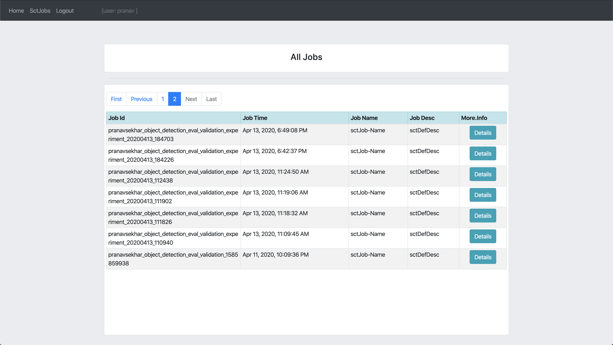
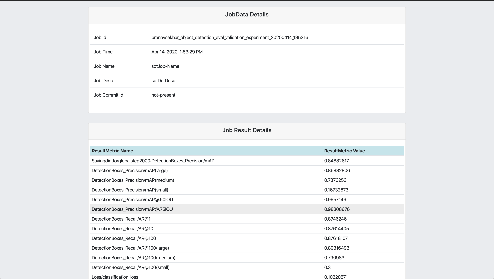
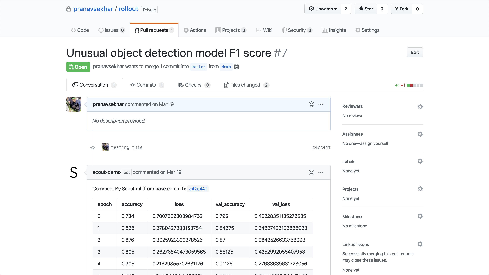

# Scout.ml: Dead simple CI/CD for ML teams.

Scout.ml is a tool to track, version, and deploy machine learning experiments from within your Git workflow.

There are 3 components:
1. CLI tool: `sct`
2. Web app: https://app.scout.ml:16043
3. GitHub app: [Link here]

## 0. Setup

1. Edit `user_config.yaml` in `.scout/` directory.
2. Run `sct init` in the root directory of the ML project.

Example config file:

```yaml
# /Users/gilfoyle/chatbot/.scout/user_config.yaml:

version: 1

scout:
  job_id_ref: "EVAL_JOB_ID"
  root_dir: "/Users/gilfoyle/chatbot"
  remote:
    platform: "gcloud" # gcloud, aws
    url: "gs://piedpiper"
    executable_path: "/Users/gilfoyle/google-cloud-sdk/bin/gcloud"
  bucket_id: "gs://piedpiper"

app:
  username: "gilfoyle"
  password: "gilfoyle123"
```

`job_id_ref`: variable of evaluation job ID in `.sh` or `.py` script  
`remote`: set up connection with cloud ML platform (gcloud, aws)  
`url`: URL of cloud storage bucket  
`executable_path`: absolute path of cloud ML platform CLI executable  
`app`: credentials for web app login  

## 1. CLI Tool

Every time an experiment is run, Scout automatically tracks/versions models, datasets, and code.

Core CLI commands:
1. `sct run [FILE]`. File can be either `.sh` or `.py` and should contain training and evaluation code. Usage: `sct run train_and_evaluate.py`.
2. `git push-sct`. Git hook to automatically associate Git commit hashes with experiment data. Using this will push code normally to GitHub/GitLab and update Scout data.

## 2. Web app: https://app.scout.ml:16043

Full log of all ML experiments and results run with `sct run`. Experiments linked with Git commits from running `git push-sct` will be flagged for review/deployment.




## 3. GitHub app: [Link here]

After pushing to GitHub with `git push-sct`, opening a pull request will trigger the Scout.ml bot to auto-comment with experiment results + metadata. Roadmap: Scout.ml will automatically detect model regressions + flag dataset changes. GitHub app will prevent merge/raise error within PR console.

